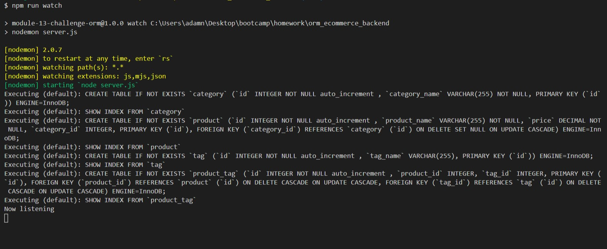
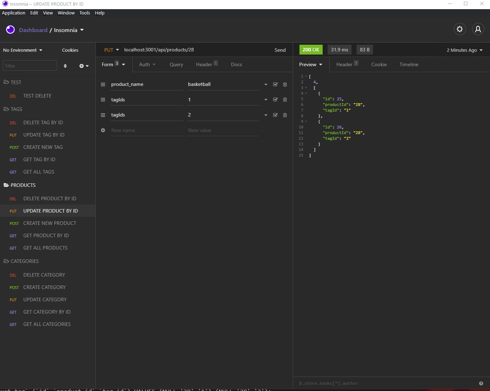
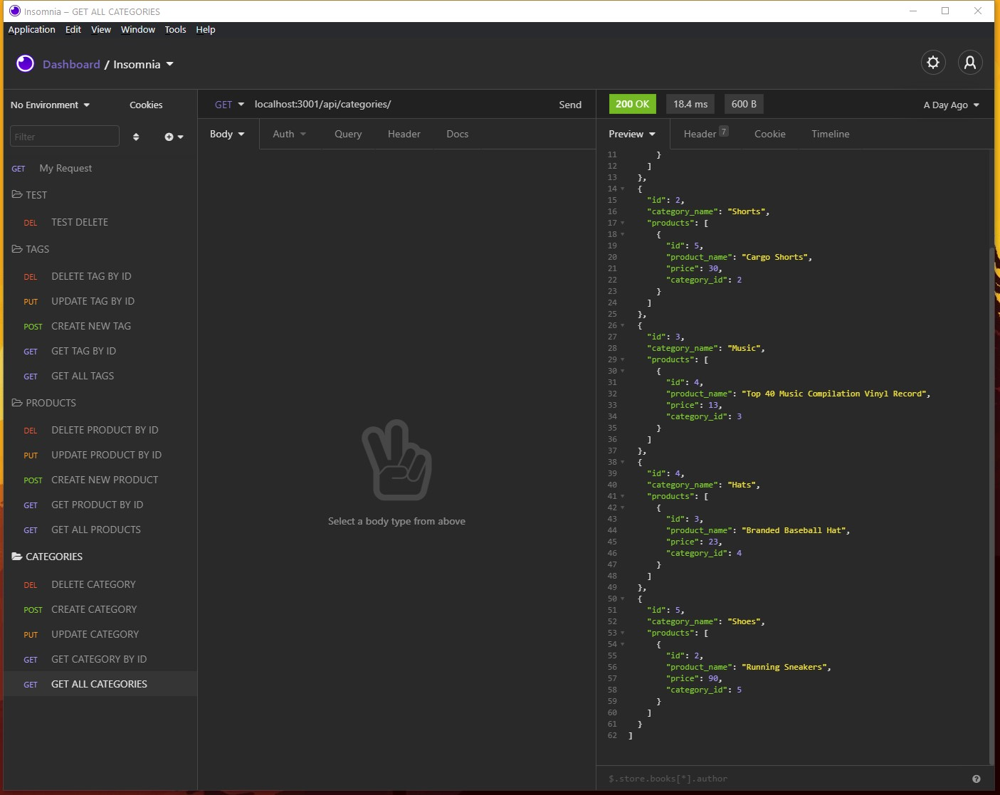

# ORM E-Commerce Backend

## Description

Backend of a simple ecommerce site. Using Insomnia to test the connection between a MySQL database using sequalize, node, dotenv, nodemon and express to simulate an ecommerce site. Test Get, Put, Update, and Delete calls to Add, remove, and update categories, products and tags. 

## Github Repo Link

https://github.com/adamnatrop/orm_ecommerce

## Walkthrough Video Link

Click on the link to watch a walkthrough video

## Screenshots 

Launch 

